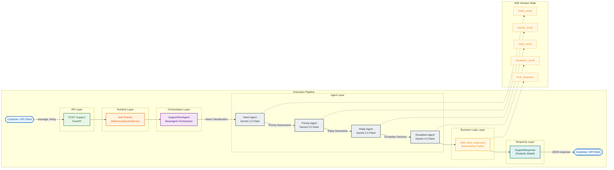
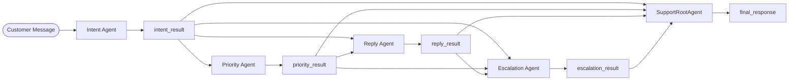
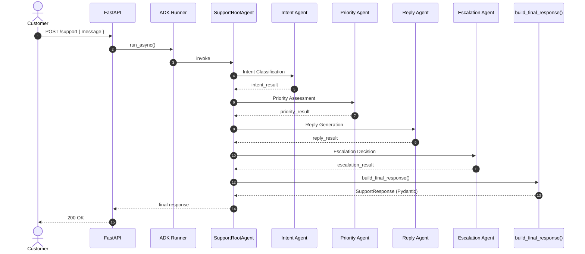

# Architecture

> **Shopify Support Automation** — Google ADK multi-agent prototype for eCommerce customer support.
>
> Stack: FastAPI · Google ADK · Gemini 2.5 Flash · Pydantic · Python 3.11+

---

## Overview

This system automates first-line eCommerce customer support by routing each inbound message through a **deterministic multi-agent pipeline**. A FastAPI service exposes a single endpoint (`POST /support`) that accepts a customer message and returns a structured JSON response containing classified intent, priority, a professional reply, and an escalation decision.

The architecture separates **orchestration** from **specialist reasoning**:

| Layer | Component | Role |
|-------|-----------|------|
| API | FastAPI | HTTP ingress, request validation, error handling |
| Runtime | ADK Runner | Session lifecycle, event streaming, agent execution |
| Orchestrator | `SupportRootAgent` | Sequential delegation, state management, aggregation |
| Specialists | Intent / Priority / Reply / Escalation | LLM-powered analysis via Gemini 2.5 Flash |
| Aggregation | `build_final_response()` | Deterministic merge — no LLM |

Design principle: **LLMs reason; Python decides structure.** The root agent never classifies intents or writes customer replies. Final JSON assembly is pure business logic in `state_utils.py`.

---

## Execution Flow

```text
Customer / API Client
       ↓
POST /support  (FastAPI)                    ← API Layer
       ↓
ADK Runner  (InMemorySessionService)        ← Runtime Layer
       ↓
SupportRootAgent  (BaseAgent Orchestrator)  ← Orchestration Layer
       ↓
Intent Agent        (Intent Classification)
       ↓
Priority Agent      (Priority Assessment)
       ↓
Reply Agent         (Reply Generation)
       ↓
Escalation Agent    (Escalation Decision)   ← Agent Layer
       ↓
build_final_response()  (Deterministic)     ← Business Logic Layer
       ↓
SupportResponse  (Pydantic Model)           ← Response Layer
       ↓
Customer / API Client
```

### Request lifecycle

1. **Ingress** — Client sends `{"message": "..."}` to `POST /support`.
2. **Session creation** — ADK Runner creates an ephemeral session (`InMemorySessionService`).
3. **Orchestration** — `SupportRootAgent` invokes each specialist agent sequentially.
4. **State accumulation** — Each specialist writes structured output to session state via `output_key`.
5. **Aggregation** — Root agent calls `build_final_response()` to merge state into `SupportResponse`.
6. **Response** — FastAPI returns validated Pydantic JSON to the client.

---

## System Architecture Diagram



> Standalone source: [`architecture.mmd`](./architecture.mmd)

---

## Architecture Layers

The execution pipeline is organised into six logical layers. Each layer has a single responsibility and communicates through well-defined interfaces.

| Layer | Component | Responsibility |
|-------|-----------|----------------|
| **API Layer** | `POST /support` · FastAPI | HTTP ingress, request validation (`SupportRequest`), error handling |
| **Runtime Layer** | ADK Runner · `InMemorySessionService` | Session lifecycle, event streaming, agent invocation |
| **Orchestration Layer** | `SupportRootAgent` | Sequential sub-agent delegation, state coordination, final event emission |
| **Agent Layer** | Intent · Priority · Reply · Escalation | LLM-powered specialist reasoning via Gemini 2.5 Flash |
| **Business Logic Layer** | `build_final_response()` | Deterministic merge of specialist outputs — no LLM |
| **Response Layer** | `SupportResponse` (Pydantic) | Typed, validated API response returned to client |

### Agent pipeline steps

| Step | Transition Label | Agent | State Written |
|------|------------------|-------|---------------|
| 1 | Intent Classification | Intent Agent | `intent_result` |
| 2 | Priority Assessment | Priority Agent | `priority_result` |
| 3 | Reply Generation | Reply Agent | `reply_result` |
| 4 | Escalation Decision | Escalation Agent | `escalation_result` |
| 5 | — | `build_final_response()` | `final_response` |

---

## Agent Responsibilities

### SupportRootAgent (`root_agent.py`)

**Type:** `BaseAgent` (custom orchestrator — not an LLM agent)

| Responsibility | Detail |
|----------------|--------|
| Orchestrate specialists | Runs sub-agents in fixed order |
| Sequential execution | Intent → Priority → Reply → Escalation |
| Session state management | Relies on ADK `output_key` writes |
| Collect outputs | Reads all four specialist state keys |
| Build final response | Calls `build_final_response()` |
| Return JSON | Emits final `Event` with `SupportResponse` |

**Does NOT:** classify intents, generate replies, or use an LLM for aggregation.

---

### Intent Agent (`agents/intent/`)

| Attribute | Value |
|-----------|-------|
| **Purpose** | Classify customer issue into a support category |
| **Model** | Gemini 2.5 Flash |
| **Input** | Customer message (conversation context) |
| **Output schema** | `IntentOutput` |
| **State key** | `intent_result` |

**Possible intents:**

- Shipping Delay
- Refund Request
- Return Request
- Product Damage
- Cancellation
- General Inquiry

---

### Priority Agent (`agents/priority/`)

| Attribute | Value |
|-----------|-------|
| **Purpose** | Determine ticket urgency |
| **Model** | Gemini 2.5 Flash |
| **Reads** | `intent_result` |
| **Output schema** | `PriorityOutput` |
| **State key** | `priority_result` |

**Possible values:** `High` · `Medium` · `Low`

**Rules (prompt-guided):**

| Condition | Priority |
|-----------|----------|
| Refund Request | High |
| Product Damage | High |
| Shipping Delay > 7 days | High |
| General Inquiry | Low |

---

### Reply Agent (`agents/reply/`)

| Attribute | Value |
|-----------|-------|
| **Purpose** | Generate concise, professional customer reply |
| **Model** | Gemini 2.5 Flash |
| **Reads** | `intent_result`, `priority_result` |
| **Output schema** | `ReplyOutput` |
| **State key** | `reply_result` |

**Constraints:** No internal system references. No refund promises.

---

### Escalation Agent (`agents/escalation/`)

| Attribute | Value |
|-----------|-------|
| **Purpose** | Decide if a human agent should review the ticket |
| **Model** | Gemini 2.5 Flash |
| **Reads** | `intent_result`, `priority_result`, `reply_result` |
| **Output schema** | `EscalationOutput` |
| **State key** | `escalation_result` |

**Escalate when:**

- Priority is High
- Refund requested
- Customer is angry
- Product damaged
- Policy exception required
- Customer requests a manager

---

## Session State Management

Specialist agents communicate through **ADK shared session state**. Each agent uses `output_schema` (Pydantic) and `output_key` to write structured results. Downstream agents read prior results via `{state_key}` placeholders in their prompts.

### State flow diagram



> Standalone source: [`session_flow.mmd`](./session_flow.mmd)

### State key contract

| Key | Writer | Readers | Payload |
|-----|--------|---------|---------|
| `intent_result` | Intent Agent | Priority, Reply, Escalation, Root | `{ "intent": "..." }` |
| `priority_result` | Priority Agent | Reply, Escalation, Root | `{ "priority": "High\|Medium\|Low" }` |
| `reply_result` | Reply Agent | Escalation, Root | `{ "reply": "..." }` |
| `escalation_result` | Escalation Agent | Root | `{ "escalate": true\|false }` |
| `final_response` | SupportRootAgent | FastAPI (fallback) | Full `SupportResponse` |

Constants are defined in `constants.py` (`INTENT_RESULT_KEY`, etc.).

---

## Sequence Diagram



> Standalone source: [`sequence_diagram.mmd`](./sequence_diagram.mmd)

---

## Deterministic Aggregation

Final response assembly is **not** delegated to an LLM. After all specialists complete, `SupportRootAgent` calls `build_final_response()` in `state_utils.py`:

```python
SupportResponse(
    intent=state["intent_result"]["intent"],
    priority=state["priority_result"]["priority"],
    reply=state["reply_result"]["reply"],
    escalate=state["escalation_result"]["escalate"],
)
```

**Why deterministic aggregation?**

| Benefit | Explanation |
|---------|-------------|
| Predictability | Same state always produces same JSON |
| Testability | Unit tests without LLM calls |
| Cost | No extra Gemini invocation per request |
| Reliability | No schema drift from LLM paraphrasing |
| Auditability | Clear mapping from specialist outputs to API response |

---

## API Contract

### Request

```http
POST /support
Content-Type: application/json

{
  "message": "My order has not arrived in 12 days and I want a refund."
}
```

### Response

```json
{
  "intent": "Refund Request",
  "priority": "High",
  "reply": "We apologize for the delay. Our support team is reviewing your refund request.",
  "escalate": true
}
```

Validated by Pydantic models in `schemas.py` (`SupportRequest`, `SupportResponse`).

---

## Project Structure

```text
shopify_ai_agent/
├── agents/
│   ├── intent/          agent.py, prompt.py
│   ├── priority/        agent.py, prompt.py
│   ├── reply/           agent.py, prompt.py
│   └── escalation/      agent.py, prompt.py
├── docs/
│   ├── architecture.md
│   ├── architecture.mmd
│   ├── session_flow.mmd
│   └── sequence_diagram.mmd
├── root_agent.py        SupportRootAgent orchestrator
├── main.py              FastAPI application
├── schemas.py           Pydantic models
├── constants.py         Intent labels, state keys
├── state_utils.py       Aggregation logic
├── config.py            App configuration
└── requirements.txt
```

---

## Production Considerations

| Area | Current (Prototype) | Production Recommendation |
|------|---------------------|---------------------------|
| **Session store** | `InMemorySessionService` | `DatabaseSessionService` or Cloud SQL |
| **Secrets** | `.env` file | Secret Manager / Vault |
| **Observability** | Basic logging | OpenTelemetry traces, structured JSON logs |
| **Retries** | None | Tenacity for Gemini 429/503 |
| **Rate limiting** | None | FastAPI middleware per API key |
| **Caching** | None | Redis cache for repeated messages |
| **Auth** | Open endpoint | API key / OAuth2 on `/support` |
| **Sentiment** | Embedded in prompts | Dedicated `sentiment_agent` upstream |
| **Shopify integration** | None | `get_order_status()` FunctionTool |
| **Deployment** | Local uvicorn | Cloud Run / GKE with health checks |
| **Testing** | Manual curl | Unit tests for `build_final_response()`, agent eval datasets |

---

## Exporting Diagrams to PNG

Diagrams are maintained as standalone Mermaid (`.mmd`) files in `docs/`. Use the [Mermaid CLI](https://github.com/mermaid-js/mermaid-cli) to export PNGs for README or assignment reports.

### Install

```bash
npm install -g @mermaid-js/mermaid-cli
```

### Export all diagrams

```bash
cd shopify_ai_agent/docs

mmdc -i architecture.mmd      -o architecture.png      -b transparent -w 1400
mmdc -i session_flow.mmd      -o session_flow.png      -b transparent -w 1400
mmdc -i sequence_diagram.mmd  -o sequence_diagram.png  -b transparent -w 1200
```

### Embed in README

```markdown


```

### Tips

- Use `-b transparent` for clean report backgrounds.
- Use `-w` / `-H` to control resolution for print-quality exports.
- Re-export after any `.mmd` source change to keep PNGs in sync.

---

## Technology Reference

| Component | Package / Module |
|-----------|------------------|
| Web framework | `fastapi`, `uvicorn` |
| Agent framework | `google-adk` |
| LLM | Gemini 2.5 Flash (`constants.GEMINI_MODEL`) |
| Validation | `pydantic` (`schemas.py`) |
| Configuration | `python-dotenv` (`.env`) |
| Orchestrator | `SupportRootAgent` (`google.adk.agents.BaseAgent`) |
| Specialists | `google.adk.agents.Agent` with `output_schema` |

---

*Document generated for the Shopify Support Automation prototype. Reflects implementation as of the modular package refactor.*
